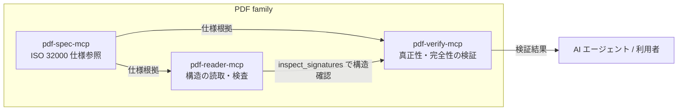
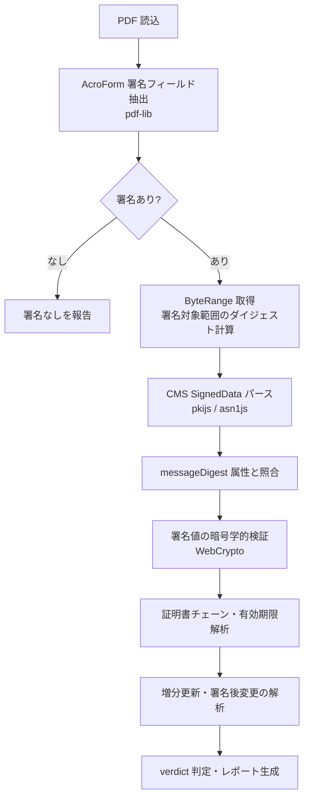
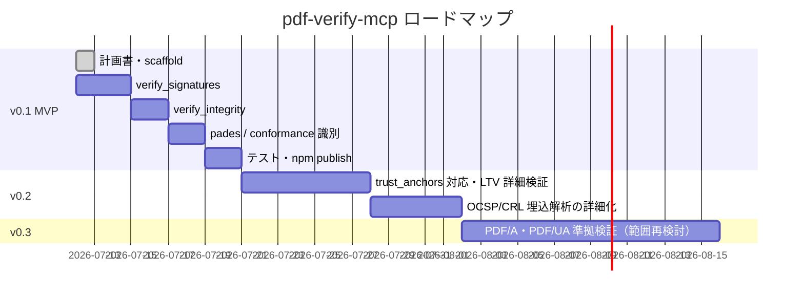

# pdf-verify-mcp プロジェクト計画書

> Issue [#1](https://github.com/shuji-bonji/pdf-verify-mcp/issues/1) 対応
> 作成日: 2026-07-12

## 1. 目的

PDF の**真正性・完全性の検証**に特化した MCP サーバを提供する。

[pdf-reader-mcp](https://github.com/shuji-bonji/pdf-reader-mcp) の `inspect_signatures` は署名フィールドの**構造のみ**を検査し、「Cryptographic signature verification is not performed」と明記している。本プロジェクトはその先、すなわち暗号学的検証を担当する。

### PDF family における位置づけ



役割分担の原則: **reader は「何があるか」、verify は「それが正しいか」**。

## 2. スコープ

| 領域 | 内容 | フェーズ |
|------|------|---------|
| 電子署名の暗号学的検証 | ByteRange ダイジェスト検証、CMS/PKCS#7 署名検証、証明書チェーン解析 | v0.1 (MVP) |
| 改ざん検知 | 増分更新解析、署名後変更の検出、DocMDP 権限チェック | v0.1 (MVP) |
| PAdES/LTV レベル判定 | B-B / B-T / B-LT / B-LTA の構造判定、DSS/VRI・DocTimeStamp 解析 | v0.1 は構造判定、v0.2 で詳細化 |
| PDF/A・PDF/UA 準拠 | v0.1 は XMP 宣言の**識別**のみ。完全な準拠性検証（veraPDF 相当）は v0.3 以降で範囲を再検討 | v0.1 識別 / v0.3 検証 |

### スコープ外（明示）

- 署名の**付与**（signing）— 検証専用とする
- OS / 商用トラストストアとの完全な信頼性評価（v0.1 は「暗号学的に有効か」まで。トラストアンカー指定は v0.2 で `trust_anchors` パラメータとして検討）
- OCSP / CRL のオンライン照会（v0.2 以降。v0.1 は埋め込み失効情報の存在確認まで）

## 3. 提供ツール（v0.1）

| ツール | 役割 | 主な出力 |
|--------|------|---------|
| `verify_signatures` | 署名の暗号学的検証 | 署名ごとの verdict（valid / invalid / indeterminate）、ダイジェスト一致、CMS 署名検証結果、証明書情報・有効期限 |
| `verify_integrity` | 改ざん検知 | 増分更新回数、署名後の変更有無、ByteRange カバレッジ、DocMDP 権限と違反 |
| `detect_pades_level` | PAdES レベル判定 | 署名ごとの B-B/B-T/B-LT/B-LTA 判定と根拠（timestamp / DSS / DocTimeStamp） |
| `identify_conformance` | 準拠宣言の識別 | XMP 上の PDF/A (pdfaid) / PDF/UA (pdfuaid) 宣言。※検証ではなく識別 |

### verdict の設計

| verdict | 意味 |
|---------|------|
| `valid` | ダイジェスト一致かつ CMS 署名が暗号学的に有効 |
| `invalid` | ダイジェスト不一致、または署名検証失敗（改ざんの疑い） |
| `indeterminate` | 暗号学的には有効だが信頼評価が未実施（トラストアンカー未指定等）、または検証不能な形式 |

信頼チェーンの評価をしない v0.1 では「暗号学的に有効」= `valid` とし、`trust: 'not_evaluated'` を必ず併記して誤解を防ぐ。

## 4. 検証フロー



## 5. 技術スタック・依存ライセンス

調査日: 2026-07-12（npm registry latest）

| パッケージ | バージョン | ライセンス | 用途 |
|-----------|-----------|-----------|------|
| `@modelcontextprotocol/sdk` | ^1.x | MIT | MCP サーバ |
| `pkijs` | 3.4.0 | BSD-3-Clause | CMS/PKCS#7・X.509 解析と検証 |
| `asn1js` | 3.0.10 | BSD-3-Clause | ASN.1 パース（pkijs の基盤） |
| `pdf-lib` | ^1.17.1 | MIT | PDF 構造（AcroForm/署名辞書）解析 |
| `zod` | ^3.x | MIT | 入力スキーマ |

pkijs の推移的依存（@noble/hashes: MIT, pvtsutils/pvutils: MIT, bytestreamjs: BSD-3-Clause, tslib: 0BSD）も含め**すべて許容的ライセンス**であり、本プロジェクト（MIT）への組込みに問題なし。コピーレフト系依存なし。

開発環境は PDF family 標準に合わせる: TypeScript 5.x / ESM / Node >= 20 / vitest / biome。

## 6. ディレクトリ構成

`shuji-mcp-patterns` スキルのテンプレートおよび pdf-reader-mcp の構成に準拠。

```
src/
├── index.ts              # エントリ（stdout ガード → McpServer 起動）
├── config.ts             # package.json から動的バージョン取得（Pattern B）
├── constants.ts          # 上限値・enum
├── schemas/              # zod 入力スキーマ
├── services/
│   ├── pdf-parser.ts     # 署名フィールド・増分更新・DSS 抽出
│   ├── cms-verifier.ts   # pkijs による CMS 検証
│   └── conformance.ts    # XMP 宣言識別
├── tools/                # 1 ツール 1 ファイル（registerTool 方式）
├── types.ts
└── utils/
    ├── logger.ts         # Pattern C
    ├── error-handler.ts  # 構造化エラー
    └── formatter.ts      # markdown / json 出力
tests/
├── fixtures/             # 自己署名証明書 + 署名済み PDF の生成スクリプト
└── unit/
```

## 7. マイルストーン



| バージョン | 完了条件 |
|-----------|---------|
| v0.1 | 4 ツールが動作し、署名済みフィクスチャで vitest 全通過。npm publish |
| v0.2 | `trust_anchors` によるチェーン信頼評価、PAdES B-LT/B-LTA の失効情報検証 |
| v0.3 | PDF/A・PDF/UA の準拠検証（自前サブセット実装 or veraPDF 連携の判断を含む） |

## 8. テスト戦略

- フィクスチャは**生成スクリプトで再現可能に**する（バイナリ資産をリポジトリに極力持たない）
  - WebCrypto + pkijs で自己署名証明書を生成し、最小 PDF に CMS 署名を埋め込む
  - 改ざんフィクスチャ: 署名済み PDF の署名対象バイトを書き換えたもの
  - 増分更新フィクスチャ: 署名後に追記したもの
- ユニットテスト: vitest。ByteRange 計算、CMS パース、verdict 判定を個別に検証
- 実運用 PDF（Adobe / 電子署名サービス発行）での手動検証を publish 前チェックリストに含める

## 9. リスクと対応

| リスク | 対応 |
|--------|------|
| CMS/署名形式の多様性（adbe.pkcs7.detached / ETSI.CAdES.detached / adbe.pkcs7.sha1 等） | v0.1 は detached 2 形式を対象。未対応形式は `indeterminate` + 理由を返す |
| 「valid」表示の過信（信頼評価をしていないのに有効と誤解） | verdict と別に `trust: not_evaluated` を常時併記。README にも明記 |
| PDF/A 検証の際限ない範囲拡大 | v0.1 では識別に限定し、検証は v0.3 で veraPDF 連携案と比較検討 |
| pdf-lib が破損 PDF をパースできない | パース失敗時は構造化エラー（pdf-reader-mcp の error contract に準拠） |

## 10. リリース

`shuji-mcp-patterns` の release-workflow（Pattern F）に従う: version bump → CHANGELOG → git tag → npm publish（provenance 付き）。パッケージ名は `@shuji-bonji/pdf-verify-mcp`。
