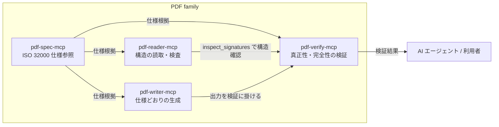
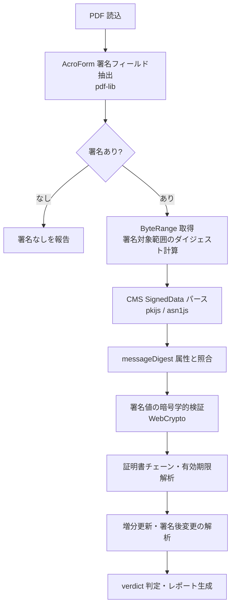

# pdf-verify-mcp プロジェクト計画書

> Issue [#1](https://github.com/shuji-bonji/pdf-verify-mcp/issues/1) 対応
> 作成日: 2026-07-12 ／ **改訂: 2026-08-22（v0.17.0 時点に追随・V-D1）**

> **この文書の読み方（改訂時の注記）**: v0.1 の計画として書かれた文書を、実績で上書きせず
> **「計画」と「その後どうなったか」を並記する形**に改めた。計画時の判断は残してある —
> 何を先送りにし、どこで判断を変えたかが追えることが、この文書の残す価値だからである。
> 日々の残タスクは [`TASKS.md`](TASKS.md)、変更の全履歴は [`CHANGELOG.md`](../CHANGELOG.md) が持つ。

## 1. 目的

PDF の**真正性・完全性の検証**に特化した MCP サーバを提供する。

[pdf-reader-mcp](https://github.com/shuji-bonji/pdf-reader-mcp) の `inspect_signatures` は署名フィールドの**構造のみ**を検査し、「Cryptographic signature verification is not performed」と明記している。本プロジェクトはその先、すなわち暗号学的検証を担当する。

### PDF family における位置づけ


```mermaid
flowchart LR
    subgraph PDF family
        SPEC[pdf-spec-mcp<br>ISO 32000 仕様参照]
        READER[pdf-reader-mcp<br>構造の読取・検査]
        VERIFY[pdf-verify-mcp<br>真正性・完全性の検証]
        WRITER[pdf-writer-mcp<br>仕様どおりの生成]
    end
    SPEC -->|仕様根拠| READER
    SPEC -->|仕様根拠| VERIFY
    SPEC -->|仕様根拠| WRITER
    READER -->|inspect_signatures で構造確認| VERIFY
    WRITER -->|出力を検証に掛ける| VERIFY
    VERIFY -->|検証結果| USER[AI エージェント / 利用者]
```

役割分担の原則: **reader は「何があるか」、verify は「それが正しいか」**。
（計画時は 3 サーバだった。その後 pdf-writer-mcp が加わり、verify は writer の
`write → validate → 直す` ループの採点側も担っている。）

## 2. スコープ

| 領域 | 内容 | 計画（2026-07-12） | 実績（2026-08-22 時点・v0.17.0） |
|------|------|---------|---------|
| 電子署名の暗号学的検証 | ByteRange ダイジェスト検証、CMS/PKCS#7 署名検証、証明書チェーン解析 | v0.1 (MVP) | ✅ 0.1.0。信頼チェーン評価は 0.2.0（`trust_anchors`）、AIA 補完とオンライン失効照会は 0.4.0、暗号化 PDF は 0.5.x、文書タイムスタンプの実検証は 0.14.2 |
| 改ざん検知 | 増分更新解析、署名後変更の検出、DocMDP 権限チェック | v0.1 (MVP) | ✅ 0.1.0 → 0.10.0 でオブジェクト単位のリビジョン差分 → 0.14.0 で DocMDP を P=1/2/3 ごとに判定（3 値の `violationAssessment`）→ 0.15.0〜0.17.0 で xref チェーンの歩き方を是正し、`revisionChain` / `revisionCountAgreement` をフィールド化 |
| PAdES/LTV レベル判定 | B-B / B-T / B-LT / B-LTA の構造判定、DSS/VRI・DocTimeStamp 解析 | v0.1 は構造判定、v0.2 で詳細化 | ✅ 0.1.0 構造判定 → 0.2.0 で失効情報・タイムスタンプの内容検証 → 0.8.0 で「観測であって適合判定ではない」ことを明示（`normativeBasis: 'T3'`） |
| PDF/A・PDF/UA 準拠 | v0.1 は XMP 宣言の**識別**のみ。完全な準拠性検証（veraPDF 相当）は v0.3 以降で範囲を再検討 | v0.1 識別 / v0.3 検証 | ✅ 識別 0.1.0 → **0.3.0 で検証**。「範囲再検討」の答えは**ハイブリッド** = veraPDF があれば委譲し、無ければ内蔵サブセット（`compliant: null` = 適合証明ではない、を保つ）。0.6.0 で PDF/UA、0.11.0 で PDF/A-4（4e/4f）まで |
| ISO 32000 本体条文の制約検査 | （計画時には無かった領域） | — | ➕ 0.9.0 `validate_clauses`（`@shuji-bonji/pdf-constraints` に委譲・veraPDF が見ない領域）。0.12.0 で 3 ドメイン 26 制約 |
| 4 値の信頼判定 | （計画時には無かった領域） | — | ➕ 0.7.0 `evaluate_policy`。「ジャッジはコード、ナラティブは LLM」— pdf-trust Skill の判定基盤 |

### スコープ外（明示）

- 署名の**付与**（signing）— 検証専用とする（**現在も不変**。writer 側にも無い）
- OS / 商用トラストストアとの完全な信頼性評価 — `trust_anchors` は **0.2.0 で実装済み**。
  OS ストア連携は現在もスコープ外（アンカーは利用者が渡す）
- ~~OCSP / CRL のオンライン照会~~ — **0.2.0（embedded）/ 0.4.0（online + AIA 補完）で実装済み**

## 3. 提供ツール

計画時（v0.1）は上 4 つ。下 3 つはその後に加わった。

| ツール | 役割 | 主な出力 | 初出 |
|--------|------|---------|------|
| `verify_signatures` | 署名の暗号学的検証 | 署名ごとの verdict（valid / invalid / indeterminate）、ダイジェスト一致、CMS 署名検証結果、証明書情報・有効期限、信頼チェーン・失効確認 | 0.1.0 |
| `verify_integrity` | 改ざん検知 | 増分更新回数、署名後の変更有無、DocMDP 権限と 3 値の違反判定、オブジェクト単位のリビジョン差分、`revisionChain` / `revisionCountAgreement` | 0.1.0 |
| `detect_pades_level` | PAdES レベル判定 | 署名ごとの B-B/B-T/B-LT/B-LTA 判定と根拠（timestamp / DSS / DocTimeStamp）。観測（T3）であって適合判定ではない | 0.1.0 |
| `identify_conformance` | 準拠宣言の識別 | XMP 上の PDF/A (pdfaid) / PDF/UA (pdfuaid) 宣言。※検証ではなく識別 | 0.1.0 |
| `validate_conformance` | PDF/A・PDF/UA の準拠**検証** | veraPDF 委譲 + 内蔵サブセットのハイブリッド。PDF/A-1〜4・PDF/UA-1。`authoritativeValidation` で権威検証の実施有無を明示 | 0.3.0 |
| `evaluate_policy` | 4 値の信頼判定 | trust_and_use / use_with_caution / human_review_required / reject と発火ルール。決定論的ルールエンジン | 0.7.0 |
| `validate_clauses` | ISO 32000 本体条文の制約検査 | フォント埋め込み / メタデータ / 注釈の 3 ドメイン 26 制約。判定は `@shuji-bonji/pdf-constraints` に委譲 | 0.9.0 |

### verdict の設計

| verdict | 意味 |
|---------|------|
| `valid` | ダイジェスト一致かつ CMS 署名が暗号学的に有効 |
| `invalid` | ダイジェスト不一致、または署名検証失敗（改ざんの疑い） |
| `indeterminate` | 暗号学的には有効だが信頼評価が未実施（トラストアンカー未指定等）、または検証不能な形式 |

信頼チェーンの評価をしない v0.1 では「暗号学的に有効」= `valid` とし、`trust: 'not_evaluated'` を必ず併記して誤解を防ぐ。

> **その後**: この 3 値は署名単体の検証結果として現在も同じ。文書全体としての
> 「信用してよいか」は 0.7.0 の `evaluate_policy` が **4 値**で別に答える。
> 「判定できなかったを合格に読ませない」という方針は、その後も
> `violationAssessment: 'indeterminate'`（0.14.0）・native 検証の `compliant: null`（0.3.0）で貫かれている。

## 4. 検証フロー


```mermaid
flowchart TD
    A[PDF 読込] --> B[AcroForm 署名フィールド抽出<br>pdf-lib]
    B --> C{署名あり?}
    C -->|なし| Z[署名なしを報告]
    C -->|あり| D[ByteRange 取得<br>署名対象範囲のダイジェスト計算]
    D --> E[CMS SignedData パース<br>pkijs / asn1js]
    E --> F[messageDigest 属性と照合]
    F --> G[署名値の暗号学的検証<br>WebCrypto]
    G --> H[証明書チェーン・有効期限解析]
    H --> I[増分更新・署名後変更の解析]
    I --> J[verdict 判定・レポート生成]
```

## 5. 技術スタック・依存ライセンス

調査日: 2026-07-12（npm registry latest）

| パッケージ | バージョン | ライセンス | 用途 |
|-----------|-----------|-----------|------|
| `@modelcontextprotocol/sdk` | ^1.x | MIT | MCP サーバ |
| `pkijs` | 3.4.0 | BSD-3-Clause | CMS/PKCS#7・X.509 解析と検証 |
| `asn1js` | 3.0.10 | BSD-3-Clause | ASN.1 パース（pkijs の基盤） |
| `pdf-lib` | ^1.17.1 | MIT | PDF 構造（AcroForm/署名辞書）解析 |
| `zod` | ^3.x | MIT | 入力スキーマ |

pkijs の推移的依存（@noble/hashes: MIT, pvtsutils/pvutils: MIT, bytestreamjs: BSD-3-Clause, tslib: 0BSD）も含め**すべて許容的ライセンス**であり、本プロジェクト（MIT）への組込みに問題なし。コピーレフト系依存なし。

**追記（2026-08-22）**: その後 2 つ増えた。どちらも自作（MIT）で、上の結論は変わらない。

| パッケージ | 用途 | 初出 |
|-----------|------|------|
| `@shuji-bonji/pdf-constraints` | `validate_clauses` の制約テーブル（条文からの写像を別パッケージに固定・exact pin） | 0.9.0 |
| `normativepdf` | 相互参照セクションの読取（§7.5）。歩き方の方針（打ち切り・線形化の併合）は本サーバ側に残す | 0.15.0 |

開発環境は PDF family 標準に合わせる: TypeScript 5.x / ESM / Node >= 20 / vitest / biome。

## 6. ディレクトリ構成

`shuji-mcp-patterns` スキルのテンプレートおよび pdf-reader-mcp の構成に準拠。

```
src/
├── index.ts              # エントリ（stdout ガード → McpServer 起動）
├── config.ts             # package.json から動的バージョン取得（Pattern B）
├── constants.ts          # 上限値・enum
├── schemas/              # zod 入力スキーマ
├── services/
│   ├── pdf-parser.ts     # 署名フィールド・増分更新・DSS 抽出
│   ├── cms-verifier.ts   # pkijs による CMS 検証
│   └── conformance.ts    # XMP 宣言識別
├── tools/                # 1 ツール 1 ファイル（registerTool 方式）
├── types.ts
└── utils/
    ├── logger.ts         # Pattern C
    ├── error-handler.ts  # 構造化エラー
    └── formatter.ts      # markdown / json 出力
tests/
├── fixtures/             # 自己署名証明書 + 署名済み PDF の生成スクリプト
└── unit/
```

## 7. マイルストーン

計画時の gantt（v0.1 → v0.2 → v0.3 の 3 段）は実績で置き換えた。
v0.3 までの計画は **2026-07-19（v0.7.0）までに全部実装された**。それ以降は
計画に無かった領域が課題駆動（V-A\* / V-P\* / V-F\*、`TASKS.md` の番号規約）で増えている。

| 版 | 実績（日付は CHANGELOG） |
|-----------|---------|
| 0.1.0〜0.5.x | 計画の v0.1 + v0.2 に相当: 4 ツール・`trust_anchors`・失効確認（embedded/online + AIA）・RFC 3161・暗号化 PDF 復号 |
| 0.6.x〜0.7.x | 計画の v0.3 に相当: `validate_conformance`（PDF/A = veraPDF 委譲 + native サブセット、PDF/UA 移管）・`evaluate_policy`（4 値判定） |
| 0.8.0〜0.13.0 | 計画外へ拡張: PAdES の T3 明示・`validate_clauses`（条文制約・3 ドメイン）・オブジェクト単位リビジョン差分・PDF/A-4・`authoritativeValidation` |
| 0.14.x | 誤答の是正（V-P2）: DocMDP を P=1/2/3 ごとに判定・文書タイムスタンプの実検証 |
| 0.15.0〜0.17.0 | xref チェーンの歩き方を是正（normativepdf 0.2.0 導入・`/Prev 0` を飲まない）→ 完全性をフィールド化（`revisionChain`）→ リビジョン数の食い違いの説明をフィールド化（`revisionCountAgreement`） |

**今後**: 残タスクは [`TASKS.md`](TASKS.md) が正典（本文書では追わない）。
大きな残りは **T2**（ISO 19005-4 購入後に、veraPDF に委ねている PDF/A-4 の判定根拠を条文で当て直す）。

## 8. テスト戦略

- フィクスチャは**生成スクリプトで再現可能に**する（バイナリ資産をリポジトリに極力持たない）
  - WebCrypto + pkijs で自己署名証明書を生成し、最小 PDF に CMS 署名を埋め込む
  - 改ざんフィクスチャ: 署名済み PDF の署名対象バイトを書き換えたもの
  - 増分更新フィクスチャ: 署名後に追記したもの
- ユニットテスト: vitest。ByteRange 計算、CMS パース、verdict 判定を個別に検証
- 実運用 PDF（Adobe / 電子署名サービス発行）での手動検証を publish 前チェックリストに含める

> **その後**: 方針は維持されたまま規模が育ち、2026-08-22 時点で vitest **153 件 / 14 ファイル**。
> フィクスチャは生成スクリプト方式のまま（署名・改ざん・増分更新に加え、証明書チェーン・CRL・
> RFC 3161・暗号化・線形化まで生成で賄う）。加えて「リリース後は npx で公開版を叩く」検証が
> 運用に加わった（テスト全緑でも公開物だけが壊れる欠陥を 0.4.0 で実際に見つけたため）。

## 9. リスクと対応

| リスク | 対応（計画時） | どうなったか |
|--------|------|------|
| CMS/署名形式の多様性（adbe.pkcs7.detached / ETSI.CAdES.detached / adbe.pkcs7.sha1 等） | v0.1 は detached 2 形式を対象。未対応形式は `indeterminate` + 理由を返す | detached 2 形式 + ETSI.RFC3161（文書タイムスタンプ・0.14.2 で実検証）まで拡大。方針どおり未対応は `indeterminate` + 理由。なお 0.9.0 で「約 1/256 の署名を解析不能と誤報告」する自前の欠陥（V-P1・padding 除去が DER を削る）が見つかった — 多様性より**自分の切り出し**が先に外れた |
| 「valid」表示の過信（信頼評価をしていないのに有効と誤解） | verdict と別に `trust: not_evaluated` を常時併記。README にも明記 | 維持。さらに 0.7.0 の `evaluate_policy` が、信頼評価まで含めた文書全体の扱いを 4 値（trust_and_use / use_with_caution / human_review_required / reject）で明示する |
| PDF/A 検証の際限ない範囲拡大 | v0.1 では識別に限定し、検証は v0.3 で veraPDF 連携案と比較検討 | ハイブリッドで決着（0.3.0）: オラクルは veraPDF、native は意図的サブセットで `compliant: null` を返す。「全部通った ≠ 適合」を型で保った |
| pdf-lib が破損 PDF をパースできない | パース失敗時は構造化エラー（pdf-reader-mcp の error contract に準拠） | 構造化エラーは維持。加えて相互参照の読取自体を pdf-lib から normativepdf へ移した（0.15.0）— pdf-lib が飲み込む壊れ方（`/Prev 0` 等)を、こちらの方針で 3 値に読めるようにするため |

## 10. リリース

`shuji-mcp-patterns` の release-workflow（Pattern F）に従う: version bump → CHANGELOG → git tag → npm publish（provenance 付き）。パッケージ名は `@shuji-bonji/pdf-verify-mcp`。
