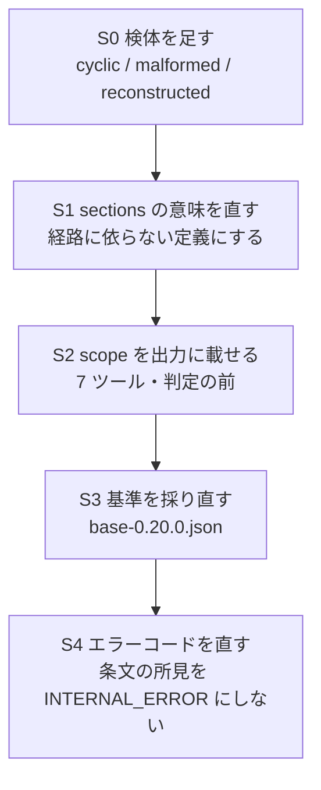

# 0.20.0 の計画 —— 判定の射程を出力に載せる

> 前提: `docs/handoff/pdflib-removal.md`（B2）。0.19.0 公開済み。
> 基準は `.golden/base-0.19.0.json`（2,947 検体 × 7 ツール = 20,629 呼び出し）。

## 1. 決めること

`DocumentScope`（`src/services/document.ts`）は、**その文書をどう読んだか**を 12 項目で
申告する。いまは内部にしか出ていない。`ParsedPdf.scope` のコメントにこう書いてある。

> 出力に載せるかは道具ごとに決める。

これを決める。載せる方向で、**載せる前に直すもの**と**測っておくもの**を先に並べる。

理由は 1 つ。`reconstructed: true` の文書は、**相互参照表が verify の推測**である。
ファイルが持っている表ではない。実測で 2,946 件のうち 6 件がこれに当たる。
この 6 件と、ファイルの表で読めた 2,940 件を、いまの出力は見分けられない。
監査の読み手にとって、これは伏せてよい事実ではない。

## 2. 実測 —— 出力の互換性

### 2.1 このサーバの出力には schema が無い

- `src` 全体で `outputSchema` と `structuredContent` は **0 件**
- 7 ツールが返すのは `content: [{ type: 'text', text }]` の 1 ブロックだけ。
  `response_format` が `json` なら `JSON.stringify(report, null, 2)`、
  `markdown` なら整形した文
- 0.18.0 で入力に入れた `.strict()`（宣言していない鍵を拒む）に相当するものは
  **出力側に存在しない**。鍵が増えてもプロトコル層は何も言わない
- `src/index.ts` は何も export しない（`check:public-types` が見る `dist/index.d.ts` は
  数行）。**`ParsedPdf` も `DocumentScope` も公開型ではない** → 型の互換性の話にならない

### 2.2 壊れうるのは 3 つだけ

| 呼び出し側 | 起きること |
|---|---|
| JSON を鍵の名前で取る | 何も起きない |
| JSON の完全一致スナップショット | 差分が出る（1 度だけ更新が要る） |
| zod `.strict()` 等で parse | 通らなくなる |
| markdown を人・LLM が読む | 何も起きない |
| markdown を節の並び・行番号で取る | ずれる |

### 2.3 前例（L1 の実測）

`validate_clauses` に `observation` を足したときの A/B。

| | |
|---|---|
| 検体 | 2,947 |
| うち「前の版に無かった鍵が増えただけ」（バケツ J） | **2,904** |
| 判定が動いたもの | **0** |

**鍵を 1 つ増やす変更は、差分としてはほぼ全件に出る。** 7 ツールに載せれば同じことが
7 倍の規模で起きる（差分約 20,000 件・判定 0 件）。

## 3. 実測 —— `scope` の 11 項目は実際どれだけ動くか

`scripts/probe-scope.mjs` を書いて、同じ 2,947 検体に `openDocument` を直接当てた
（1.9 秒）。開けたのは 2,946 件、例外 1 件。

| 項目 | 分布 |
|---|---|
| `recovered` | false 2,928 / **true 18** |
| `refusal != null` | false 2,927 / **true 19** |
| `chainStop.kind` | complete 2,938 / **unreadable 7** / **prev-zero 1** / cyclic **0** / malformed **0** |
| `newestSectionUnreadable` | false 2,937 / **true 9** |
| `continuedPastStop` | false 2,945 / **true 1** |
| `filledFromScan > 0` | false 2,944 / **true 2** |
| `reconstructed` | false 2,940 / **true 6** |
| `encrypted` | false 2,934 / **true 12** |
| `authenticated` | true 2,944 / **false 2** |
| `sections` | **0 が 2,931** / 1 が 14 / 4 以上が 1 |
| `objects` | 全件で非 0 |

### 3.1 🔴 `sections` は健全な文書で常に 0 —— 意味が経路依存

3 つの文書で中身を並べた。

```
健全       {"recovered":false,"chainStop":{"kind":"complete"},"sections":0,"objects":7,...}
recovered  {"recovered":true,"chainStop":{"kind":"complete"},"sections":1,"objects":7,
            "refusal":"cross-reference section shall begin with the keyword xref (§7.5.4)..."}
prev-zero  {"recovered":true,"chainStop":{"kind":"prev-zero"},"sections":8,"objects":152,
            "continuedPastStop":true,"filledFromScan":24}
```

**健全な文書の `sections: 0` は「相互参照節が 0 個」ではない。**
ライブラリがそのまま読んだ経路では節を数えていない、というだけである。
このまま出すと、読み手は「節が 0」と読む。

これは `observation` を足したときに直したのと**同じ間違い**を `scope` 自身が持っている
という話である —— 観測していないことと、観測して 0 だったことが同じ顔をしている。
載せる前に直す（数えるか、経路を分けて `null` にするか）。

### 3.2 この集合が踏んでいない値

- `chainStop.kind` の **`cyclic` と `malformed` は 0 件**
- `continuedPastStop` / `filledFromScan > 0` はそれぞれ **1 件・2 件**（どちらも同じ 1 検体）
- `authenticated: false` は **2 件**

つまり **回復方針が当たる経路はほとんど踏まれていない。** このまま載せると、
「載せた項目がどう動くか」を一度も見ずに公開することになる。

## 4. 実測 —— 0.19.0 が見えるようにした別の不整合（エラーコード）

`.golden/base-0.19.0.json` の `isError` は **26 件・20 ファイル**。
**26 件すべて、メッセージが条文を名指ししている。** ところが:

| `code` | 件数 | ツール |
|---|---|---|
| `INTERNAL_ERROR` | 20 | `validate_clauses` |
| `PARSE_FAILED` | 6 | 他の 6 ツール（同じ 1 ファイル） |

```json
{"error":true,"code":"INTERNAL_ERROR",
 "message":"cross-reference section shall begin with the keyword xref (§7.5.4) or be a cross-reference stream object (§7.5.8.1) (at byte 0)"}
```

**「この文書は §7.5.4 に反する」を `INTERNAL_ERROR` で返している。**
これは文書についての所見であって、サーバの故障ではない。原因は
`handleStructuredError` が `PdfVerifyError` 以外を全部 `INTERNAL_ERROR` に落とすところ。
normativepdf が投げる条文エラーは `PdfVerifyError` ではない。

困るのは受け側である。pdf-trust の Trust Report には
「未実施項目（ツール未接続・取得失敗）」という枠がある。`INTERNAL_ERROR` はそこに落ちる。
すると **「§7.5.4 に反している」という所見が「調べられませんでした」として報告される。**
下手な文書ほど無罪になる。

0.19.0 が作った問題ではない。0.18.0 までは pdf-lib がこれらを読んでしまっていたので、
そもそも `isError` にならなかった。**撤去が見えるようにした。**

## 5. 弊害（載せる側）

| # | 弊害 | 対処 |
|---|---|---|
| 1 | A/B の差が約 20,000 件出る（判定は 0 件） | バケツ J で分離できる。`scope` 追加だけの commit にして、直後に基準を採り直す |
| 2 | 出力が 11 項目 × 7 ツール分ふくらむ。markdown も 1 節増える | 判定の**前**に置く。`observation` と同じ扱い |
| 3 | 🔴 `refusal` は条文の英文がそのまま入る。内部の申告用に書いた文字列で、外に出す文面として設計していない | 文面を契約にするか、`refusal` は載せずに `chainStop` と `recovered` だけにする |
| 4 | 🔴 `encryptDict` は normativepdf の COS 辞書。`JSON.stringify` すると内部表現が出る | 載せない。必要なら `/V` `/R` `/Filter` の値だけ取り出す |
| 5 | 🔴 `sections` の意味が経路依存（§3.1） | 載せる前に直す |
| 6 | 🔴 踏んでいない値がある（§3.2） | 検体を先に足す |

## 6. 段取り



### S0 検体を足す（出力は動かさない）

`scripts/golden-specimens.mjs` に 3 つ足す。

- `chainStop.kind = 'cyclic'` —— `/Prev` が自分か祖先を指す
- `chainStop.kind = 'malformed'` —— `/Prev` が整数でない
- `reconstructed = true` を**意図して**作った検体（いまの 6 件は veraPDF の fail 検体で、
  こちらが狙って作ったものではない）

足したら `take` して、`probe-scope.mjs` の分布に 5 値すべてが出ることを確かめる。
**この段階では出力は 1 バイトも動かない** —— A/B の差は検体が増えた分だけ。

### S1 `sections` を直す（出力は動かさない・内部のみ）

ライブラリがそのまま読んだ経路でも節を数える。数えられないなら `null` にして
「この経路では数えていない」を型で表す。`0` は使わない。
テストは `sections` が経路によらず同じ意味を持つことを固定する。

### S2 `scope` を出力に載せる

- 載せる項目: `recovered` / `chainStop` / `newestSectionUnreadable` / `sections` /
  `continuedPastStop` / `filledFromScan` / `reconstructed` / `objects` /
  `encrypted` / `authenticated`（10 項目）
- 載せない: `encryptDict`（COS 辞書）。`refusal` は §5-3 の決着しだい
- 置き場所: 各ツールの報告の**先頭**。markdown は
  `Scope of this reading` を判定より前（`validate_clauses` と同じ形）
- 文言: 「判定ではなく、判定の射程」と本文に書く

### S3 基準を採り直す

```
node scripts/golden.mjs take .golden/base-0.20.0.json --label 0.20.0
node scripts/golden.mjs diff .golden/base-0.19.0.json .golden/base-0.20.0.json
node scripts/golden.mjs t3   .golden/base-0.20.0.json
```

差はすべてバケツ J であること、判定が動いた件数が 0 であることを確かめる。
0 件を主張する側には必ず t3 を対にする。

### S4 エラーコードを直す（§4）

条文を名指しする失敗に、故障と区別できるコードを与える。
`INTERNAL_ERROR` は本当に内部で落ちたときだけに戻す。
7 ツールで同じコードを使う（いまは `validate_clauses` だけ違う）。

🔴 これは pdf-trust の Trust Report の書き方に届く。`skill/pdf-trust-skill` の
「未実施項目（ツール未接続・取得失敗）」の枠に、**条文違反は入らない**と書き足すこと。
エラー契約の統一（4 サーバを揃える）は別 Issue のままでよい —— ここで直すのは
「所見を故障と呼ばない」の 1 点だけ。

## 7. 受入

| 面 | 何を見るか |
|---|---|
| 1 項目が動く | `probe-scope.mjs` の分布に `chainStop` の 5 値すべてが出る。`sections` が健全な文書で 0 にならない |
| 2 出力の A/B | `base-0.19.0` → `base-0.20.0` の差が**全部バケツ J**。判定が動いた件数 0。空振り検査の対は t3 の 14 件 |
| 3 受け側 | `reconstructed: true` の検体で、報告を読んだだけで「相互参照表は verify が組み直した」と分かる。`INTERNAL_ERROR` が条文違反に付かない |

## 8. 版と順序

- **0.20.0**（minor）。既存の鍵の意味も名前も変えず、鍵を足す = `feat`。
  S4 のコード変更は、いまの値が誤りなので同じ版に入れてよい
- 他リポジトリの追随（Skill の推奨版・plugin・pipeline）は **0.20.0 の後**。
  S4 が pdf-trust の書き方に届くので、まとめて 1 度で当てる
- `agent/pdf-agent-pipeline` の SDK v2 移行は独立（0.18.0 由来の宿題）

## 9. 0.19.0 の時点で他リポジトリに要る修正（実測）

| 対象 | 判定 |
|---|---|
| `site/` | **不要**。リファレンスは 0.19.0 で再生成済み（`observation` が入っている）・origin と同期 |
| Skill 3 本 / plugin | **必須の修正は無い**。`validate_clauses` を呼ぶ Skill は **0 本**（grep 0 件）なので `observation` は届かない。推奨版の表記（`v0.17.0+`）は嘘になっていない |
| `agent/pdf-agent-pipeline` | 0.19.0 由来ではない。SDK v1 クライアントのままという 0.18.0 の宿題 |
| **verify 自身** | 🔴 §4 のエラーコード。0.19.0 が見えるようにした |

---

# 実施結果（2026-08-29・0.20.0）

段ごとに採った。基準は `.golden/base-0.19.0.json`（2,947 検体）→
`.golden/base-0.20.0.json`（2,950 検体）。

| 段 | 出力 | 差（ファイル×ツール） | 帰属 |
|---|---|---|---|
| S0 検体 3 件 | 動かない | 共有する 2,947 件で **0 件**（増えた 3 件のみ） | 検体の追加 |
| S1 `sections` | 動かない | **0 件** | 内部の型だけ |
| S2 `scope` を 5 本に | 動く | 14,725 件 | **14,722 件がバケツ J**、3 件は切り詰めの文字列 |
| S4 `code` | 動く（`isError` のみ） | 27 件 | **全件が `isError` の payload** |
| 合計 | | 14,737 件 | **判定が動いた件数 0** |

空振り検査の対は各段で `t3` の 14 件。

## R1. S0 —— 5 値すべてを踏むようになった

`XrefChainStop` の分布（`scripts/probe-scope.mjs`）:

| 値 | 0.19.0 | 0.20.0 |
|---|---|---|
| `complete` | 2,938 | 2,938 |
| `unreadable` | 7 | 8 |
| `prev-zero` | 1 | 1 |
| `cyclic` | **0** | **1** |
| `malformed` | **0** | **1** |

`reconstructed: true` は 6 → 7 件。増えた 1 件は**狙って作ったもの**で、
それまでの 6 件は veraPDF の fail 検体に紛れていたものだった。

検体は `scripts/lib/xref-specimen-builder.mjs` が組む。**同じ組み立てを
`tests/unit/document-scope.test.ts` も読む** —— 検体とテストが別々の作り方を
していると、片方だけ狙いを外しても気づけない。

## R2. S1 —— `sections` の分布が変わった

| `sections` | 0.19.0 | 0.20.0 |
|---|---|---|
| 0 | **2,931** | **7** |
| 1 | 14 | 2,765 |
| 2 以上 | 1 | 177 |

0.19.0 の `0` は「節が 0 個」ではなく「この経路では数えていない」だった。
いま `0` は 7 件だけで、**どれも本当に節が 1 つも読めなかった文書**である。

## R3. S2 —— 増えた 3 件の切り詰めは、新しい欠陥ではない

差 14,725 件のうち 3 件がバケツ H（出力が切り詰められて JSON にならない）に
分類された。**中身を見ると、S0 の時点で既に切り詰められていた同じ 3 件で**、
切り詰め後の文字列が変わっただけである（`parsed=false` の総数は S0 も S2 も 3）。

ただし **報告は 25,000 字の上限に近づいた**（`CHARACTER_LIMIT`）。
`scope` は 1 呼び出しあたり数百バイト増やす。0.21.0 で配列 2 本にも載せるとき、
この 3 件がどうなるかを先に測ること。

## R4. S4 —— 1 度目の実測で 1 件だけ取りこぼした

`checkFile` の拒否だけを包んだところ、`ua-broken-startxref.pdf` の
`validate_clauses` だけが `INTERNAL_ERROR` のまま残った。**開く段
（`openDocument`）で拒まれる経路を素通ししていた。**

計器が無ければ「7 ツールで揃えた」と書いて終わっていた。
これは B2 の面 3（独立オラクル）が捕まえたのと同じ型である ——
**直したつもりの範囲は、測った範囲より広く見える。**

直したあと:

| | 0.19.0 | 0.20.0 |
|---|---|---|
| `isError` | 26 | 27（検体が 3 件増えた分） |
| `INTERNAL_ERROR` | 20 | **0** |
| `PARSE_FAILED` | 6 | **27** |
| 条文を名指ししているメッセージ | 26/26 | 27/27 |
| `suggestion` が付いている | 6/26 | **27/27** |

## R5. 残り —— 0.21.0（決定済み・落とさないこと）

**目的は「7 ツールが同じことを言う」である。5 本で止めると、
署名の一覧を返す 2 本だけが射程を持たないまま残る** ——
表を組み直した文書で署名が欠けていても、その一覧を見ただけでは分からない。

- [ ] `verify_signatures` を `{ scope, signatures: [...] }` に、
      `detect_pades_level` を `{ scope, levels: [...] }` にする。
      **最上位が配列から辞書に変わる = 破壊的変更**
- [ ] A/B を採り、この 2 本以外が動いていないことを確かめる。
      切り詰め（R3）の 3 件がどうなるかも見る
- [ ] 追随をまとめて当てる:
  - `skill/pdf-trust-skill` —— 推奨版を上げ、**「未実施項目（ツール未接続・
    取得失敗）」に条文違反は入らない**と書く（S4 が届く先）。
    `scope.reconstructed` の読み方も足す
  - `agent/pdf-agent-pipeline` —— `deepDive` に入る JSON の形が変わる。
    SDK v2 クライアントへの移行と同時でよい
  - `site/` —— リファレンスを再生成（**先に `npm run build`**）
- [ ] 版は **0.21.0**

---

# R5 の実施結果（2026-08-29・0.21.0）

配列 2 本を包み、**7 ツールすべてが同じことを言う状態になった**。

## R5-1. A/B —— この 2 本以外は動いていない

| | |
|---|---|
| 差 | 5,898 件（`verify_signatures` 2,949 / `detect_pades_level` 2,949） |
| ほかの 5 本 | **0 件** |
| `kept`（抽出した判定）が完全に同じ | **5,898 / 5,898** |
| 一覧の中身がバイト単位で同一 | **5,898 / 5,898** |
| 切り詰められる呼び出し | 3 件のまま（R3 の懸念は起きなかった） |

分類はバケツ G（帰属が要る）になる。**最上位の形が変わったので、計器は
「鍵が増えただけ」とは呼ばない** —— それは正しい振る舞いで、こちらが
1 件ずつ数え直す側である。

## R5-2. 🔴 計器が 1 度誤報した

`golden.mjs` の抽出は最上位が配列であることを前提にしていた。包んだ結果、
一覧が 1 バイトも変わっていないのに **48 件がバケツ E（観測できた対象が
減った）** に落ちた。中身ではなく計器が読めていなかった。

両方の形を読むよう直した。基準（0.20.0 以前）は配列のままなので、
版をまたいで比べるには両方読めないといけない。

**`kept` は take のときに確定して保存される。** 計器を直した直後に `diff` を
回しても、保存済みの `kept` を比べるだけで何も変わらない —— 1 度そうなった。
**計器を直したら採り直す。**

## R5-3. 追随（同日・別リポジトリ）

| | 版 | 入れたもの |
|---|---|---|
| `pdf-trust-skill` | 0.8.0 | Phase 1.5「読んだ範囲を確かめる」/ 🔴 条文を名指しする `PARSE_FAILED` を「未実施項目」に入れない / Trust Report に「読んだ範囲」の行 / 前提表を v0.21.0+ に |
| `pdf-publish-skill` | 0.6.0 | 読み戻しで `reconstructed: true` なら**こちらの出力の欠陥**（受け取った文書の性質ではない） |
| `pdf-agent-pipeline` | — | `structured.scope` に転記し、Trust Report の表に 1 行 |
| `site/` | — | **publish 後に再生成**（`npm run build` が先） |

## R5-4. 残り

- [ ] `site/` の再生成（publish 後）
- [ ] **reader の pdf-lib 撤去**（family 第 3 弾）。B2 で作った 3 つ
      （`xref-walk.ts` / `document.ts` / `cos.ts`）と計器 3 本がそのまま型になる

---

## 追記（2026-08-29・0.23.0）

上の S2 の「markdown は `Scope of this reading` を判定より前（`validate_clauses` と
同じ形）」を**そのまま実装したせいで、`validate_clauses` だけ同じ見出しが 2 行になった。**

`validate_clauses` には元から `report.observation`（pdf-constraints が制約を当てる
ときに観測できた範囲）を出す行があり、そこに `ReadingScope`（verify がこの文書を
どこまで読めたか）の行を同じ名前で足した形になっていた。検体 2,950 件のうち
**2,929 件**で 2 行が並んでいた。0.23.0 で 2 本目を
`Scope pdf-constraints observed` に変えた。

**なぜ 3 回の A/B で出なかったか**: `scripts/golden.mjs take` が毎回
`response_format: 'json'` を付けており、**既定の markdown の本文は 20,650 回の
呼び出しのどれにも入っていなかった**。0.23.0 で `--format json|markdown` を足し、
`report` が「`Scope of this reading` の行数」をツール別に出すようにした。

教訓は 2 つ。

1. **「同じ形にする」と書くときは、足す先に同じ名前が既に無いかを見る。**
   1 語が 2 つを指したら、それは説明ではなく食い違いを畳んだもの
2. **計器が固定している引数は、測っていない経路の一覧でもある。**
   `response_format: 'json'` は再現性のために正しいが、既定の経路を測らない理由にはならない
